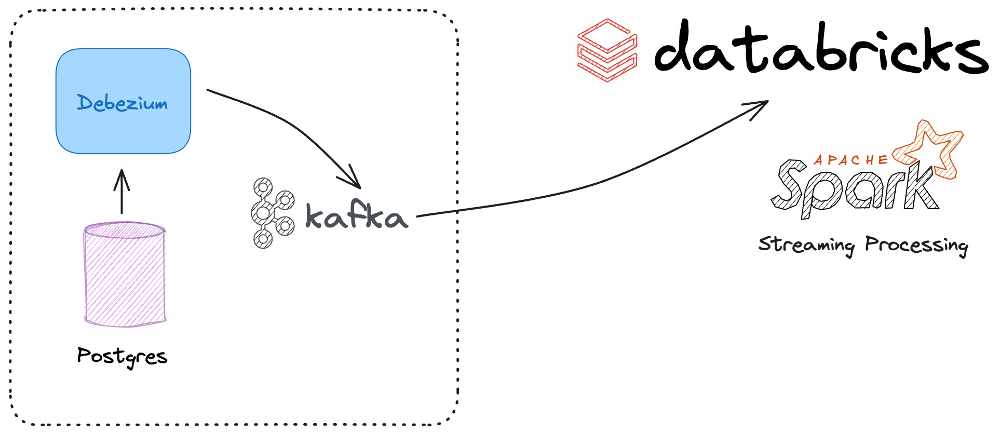

# Spark Streaming Demo


The next project seeks to make a demo of streaming data ingestion and processing.

The following tools will be used:
- Postgres v16
- Debezium for reading events in Postgres
-Spark Streaming
- Databricks with AWS ec2 (Compute engine) and S3 (Data Lake)
-Docker

### Raise services:
For this purpose and to facilitate the configuration of all services, we use docker-compose

[docker-compose.yml](./docker-compose.yml)

#### Configure Postgres to work with Debezium
You will need to copy this configurations to prepare Postgres with debezium

[pg_hba.conf](./pg_hba.conf)

Copy this file the container
```
docker cp ./pg_hba.conf <postgres-container-name>:/var/lib/postgresql/data/pg_hba.conf
```

Maybe you will need to restart the postgres and debezium container

### Initial DB

We will need to create the tables in the example database.

We are going to configure three sales tables:
products
customers
sales

[init_db.sql](./init_db.sql)

### Create connector between Kafka and Debezium
We will need to connect debenzium and kafka, and create topics to store the data stored here

[debezium_start.sh](./debezium_start.sh)

### Generate fake data
We are going to create fictitious data for both customers, products and sales.

For products and sales we will do it only once, but for sales you can run it as often as you want

[create-fake-sales](./create_fake_sales.ipynb)

### Streaming Ingest and Process with Spark Streaming

We are going to ingest data from kafka topics, and that same time window will be processed in memory. The writing will be complete for the moment.

[sales-demo-streaming](./sales_demo_streaming.ipynb)


